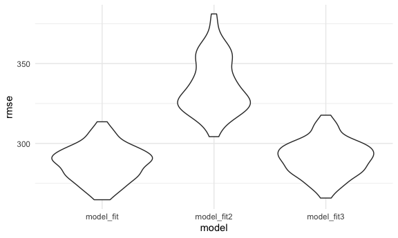
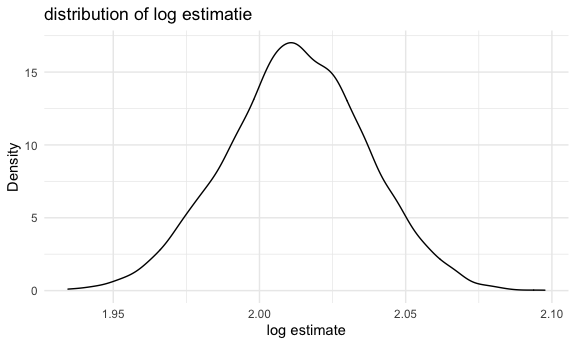
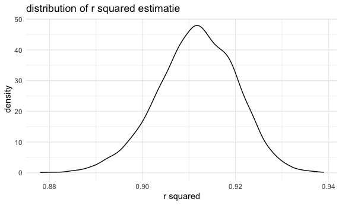

p8105\_hw6\_WZ2591
================
Wenyu Zhang
12/1/2021

``` r
library(tidyverse)
```

    ## ── Attaching packages ─────────────────────────────────────── tidyverse 1.3.1 ──

    ## ✓ ggplot2 3.3.5     ✓ purrr   0.3.4
    ## ✓ tibble  3.1.4     ✓ dplyr   1.0.7
    ## ✓ tidyr   1.1.3     ✓ stringr 1.4.0
    ## ✓ readr   2.0.1     ✓ forcats 0.5.1

    ## ── Conflicts ────────────────────────────────────────── tidyverse_conflicts() ──
    ## x dplyr::filter() masks stats::filter()
    ## x dplyr::lag()    masks stats::lag()

``` r
library(rvest)
```

    ## 
    ## Attaching package: 'rvest'

    ## The following object is masked from 'package:readr':
    ## 
    ##     guess_encoding

``` r
library(modelr)
library(mgcv)
```

    ## Loading required package: nlme

    ## 
    ## Attaching package: 'nlme'

    ## The following object is masked from 'package:dplyr':
    ## 
    ##     collapse

    ## This is mgcv 1.8-36. For overview type 'help("mgcv-package")'.

``` r
knitr::opts_chunk$set(
  fig.width = 6,
  fig.asp = .6,
  out.width = "90%"
)

theme_set(theme_minimal() + theme(legend.position = "bottom"))
options(
  ggplot2.continuous.colour = "viridis",
  ggplot2.continuous.fill = "viridis"
)

scale_colour_discrete = scale_color_viridis_d
scale_fill_discrete = scale_fill_viridis_d
```

# Problem 1

## Load and clean the data for regression analysis (i.e. convert numeric to factor where appropriate, check for missing data, etc.).

``` r
birthweight_df = 
  read_csv("data/birthweight.csv") %>% 
  janitor::clean_names() %>% 
  mutate(
    babysex = factor(babysex, 
                     levels = c("1", 
                                "2")),
    frace = factor(frace, 
                   levels = c("1", 
                              "2", 
                              "3", 
                              "4", 
                              "8", 
                              "9")),
    malform = factor(malform, 
                     levels = c("0", 
                                "1")),
    mrace = factor(mrace, 
                   levels = c("1", 
                              "2", 
                              "3", 
                              "4", 
                              "8"))
  )
```

    ## Rows: 4342 Columns: 20

    ## ── Column specification ────────────────────────────────────────────────────────
    ## Delimiter: ","
    ## dbl (20): babysex, bhead, blength, bwt, delwt, fincome, frace, gaweeks, malf...

    ## 
    ## ℹ Use `spec()` to retrieve the full column specification for this data.
    ## ℹ Specify the column types or set `show_col_types = FALSE` to quiet this message.

``` r
sum(is.na(birthweight_df))
```

    ## [1] 0

There is no NA data in this dataset

## Propose a regression model for birthweight

``` r
model_fit = lm(bwt ~ babysex + bhead + blength + gaweeks, data = birthweight_df)

model_fit %>% 
  broom::tidy() %>% 
  knitr::kable(digits = 3)
```

| term        |  estimate | std.error | statistic | p.value |
|:------------|----------:|----------:|----------:|--------:|
| (Intercept) | -6264.154 |    97.900 |   -63.985 |       0 |
| babysex2    |    33.420 |     8.839 |     3.781 |       0 |
| bhead       |   140.867 |     3.566 |    39.508 |       0 |
| blength     |    81.756 |     2.081 |    39.287 |       0 |
| gaweeks     |    14.067 |     1.513 |     9.297 |       0 |

``` r
summary(model_fit)
```

    ## 
    ## Call:
    ## lm(formula = bwt ~ babysex + bhead + blength + gaweeks, data = birthweight_df)
    ## 
    ## Residuals:
    ##      Min       1Q   Median       3Q      Max 
    ## -1120.93  -190.49   -12.36   177.87  2613.29 
    ## 
    ## Coefficients:
    ##              Estimate Std. Error t value Pr(>|t|)    
    ## (Intercept) -6264.154     97.900 -63.985  < 2e-16 ***
    ## babysex2       33.420      8.839   3.781 0.000158 ***
    ## bhead         140.867      3.566  39.508  < 2e-16 ***
    ## blength        81.756      2.081  39.287  < 2e-16 ***
    ## gaweeks        14.067      1.513   9.297  < 2e-16 ***
    ## ---
    ## Signif. codes:  0 '***' 0.001 '**' 0.01 '*' 0.05 '.' 0.1 ' ' 1
    ## 
    ## Residual standard error: 285.7 on 4337 degrees of freedom
    ## Multiple R-squared:  0.6891, Adjusted R-squared:  0.6888 
    ## F-statistic:  2403 on 4 and 4337 DF,  p-value: < 2.2e-16

``` r
modelr::add_residuals(birthweight_df, model_fit)
```

    ## # A tibble: 4,342 × 21
    ##    babysex bhead blength   bwt delwt fincome frace gaweeks malform menarche
    ##    <fct>   <dbl>   <dbl> <dbl> <dbl>   <dbl> <fct>   <dbl> <fct>      <dbl>
    ##  1 2          34      51  3629   177      35 1        39.9 0             13
    ##  2 1          34      48  3062   156      65 2        25.9 0             14
    ##  3 2          36      50  3345   148      85 1        39.9 0             12
    ##  4 1          34      52  3062   157      55 1        40   0             14
    ##  5 2          34      52  3374   156       5 1        41.6 0             13
    ##  6 1          33      52  3374   129      55 1        40.7 0             12
    ##  7 2          33      46  2523   126      96 2        40.3 0             14
    ##  8 2          33      49  2778   140       5 1        37.4 0             12
    ##  9 1          36      52  3515   146      85 1        40.3 0             11
    ## 10 1          33      50  3459   169      75 2        40.7 0             12
    ## # … with 4,332 more rows, and 11 more variables: mheight <dbl>, momage <dbl>,
    ## #   mrace <fct>, parity <dbl>, pnumlbw <dbl>, pnumsga <dbl>, ppbmi <dbl>,
    ## #   ppwt <dbl>, smoken <dbl>, wtgain <dbl>, resid <dbl>

``` r
modelr::add_predictions(birthweight_df, model_fit)
```

    ## # A tibble: 4,342 × 21
    ##    babysex bhead blength   bwt delwt fincome frace gaweeks malform menarche
    ##    <fct>   <dbl>   <dbl> <dbl> <dbl>   <dbl> <fct>   <dbl> <fct>      <dbl>
    ##  1 2          34      51  3629   177      35 1        39.9 0             13
    ##  2 1          34      48  3062   156      65 2        25.9 0             14
    ##  3 2          36      50  3345   148      85 1        39.9 0             12
    ##  4 1          34      52  3062   157      55 1        40   0             14
    ##  5 2          34      52  3374   156       5 1        41.6 0             13
    ##  6 1          33      52  3374   129      55 1        40.7 0             12
    ##  7 2          33      46  2523   126      96 2        40.3 0             14
    ##  8 2          33      49  2778   140       5 1        37.4 0             12
    ##  9 1          36      52  3515   146      85 1        40.3 0             11
    ## 10 1          33      50  3459   169      75 2        40.7 0             12
    ## # … with 4,332 more rows, and 11 more variables: mheight <dbl>, momage <dbl>,
    ## #   mrace <fct>, parity <dbl>, pnumlbw <dbl>, pnumsga <dbl>, ppbmi <dbl>,
    ## #   ppwt <dbl>, smoken <dbl>, wtgain <dbl>, pred <dbl>

``` r
birthweight_df %>% 
  add_predictions(model_fit) %>% 
  add_residuals(model_fit) %>% 
  ggplot(aes(x = pred, y = resid)) + 
  geom_point(alpha = 0.5, size = 0.5) +
  labs(x = "Predicted values", 
       y = "Residual",
       title = "plot of model residuals against fitted values")
```


## Describe your modeling process

1.  the predictors I choose are `babysex`, `bhead`, `blength` and
    `gaweeks`.

2.  Then I build a linear regression model for baby’s birth weight with
    the influences of baby’s sex, baby’s head circumference at birth,
    baby’s length at birth and gestational age in weeks.

3.  According to the plot, most of the points are between the area from
    2000 to 4000.

## Compare your model to two others:

### One using length at birth and gestational age as predictors (main effects only)

``` r
model_fit2 = lm(bwt ~ blength + gaweeks, data = birthweight_df)

model_fit2 %>% 
  broom::tidy() %>% 
  knitr::kable(digits = 3)
```

| term        |  estimate | std.error | statistic | p.value |
|:------------|----------:|----------:|----------:|--------:|
| (Intercept) | -4347.667 |    97.958 |   -44.383 |       0 |
| blength     |   128.556 |     1.990 |    64.604 |       0 |
| gaweeks     |    27.047 |     1.718 |    15.744 |       0 |

``` r
summary(model_fit2)
```

    ## 
    ## Call:
    ## lm(formula = bwt ~ blength + gaweeks, data = birthweight_df)
    ## 
    ## Residuals:
    ##     Min      1Q  Median      3Q     Max 
    ## -1709.6  -215.4   -11.4   208.2  4188.8 
    ## 
    ## Coefficients:
    ##              Estimate Std. Error t value Pr(>|t|)    
    ## (Intercept) -4347.667     97.958  -44.38   <2e-16 ***
    ## blength       128.556      1.990   64.60   <2e-16 ***
    ## gaweeks        27.047      1.718   15.74   <2e-16 ***
    ## ---
    ## Signif. codes:  0 '***' 0.001 '**' 0.01 '*' 0.05 '.' 0.1 ' ' 1
    ## 
    ## Residual standard error: 333.2 on 4339 degrees of freedom
    ## Multiple R-squared:  0.5769, Adjusted R-squared:  0.5767 
    ## F-statistic:  2958 on 2 and 4339 DF,  p-value: < 2.2e-16

### One using head circumference, length, sex, and all interactions (including the three-way interaction) between these

``` r
model_fit3 = lm(bwt ~ bhead * blength * babysex, data = birthweight_df)

model_fit3 %>% 
  broom::tidy() %>% 
  knitr::kable(digits = 3)
```

| term                   |  estimate | std.error | statistic | p.value |
|:-----------------------|----------:|----------:|----------:|--------:|
| (Intercept)            | -7176.817 |  1264.840 |    -5.674 |   0.000 |
| bhead                  |   181.796 |    38.054 |     4.777 |   0.000 |
| blength                |   102.127 |    26.212 |     3.896 |   0.000 |
| babysex2               |  6374.868 |  1677.767 |     3.800 |   0.000 |
| bhead:blength          |    -0.554 |     0.780 |    -0.710 |   0.478 |
| bhead:babysex2         |  -198.393 |    51.092 |    -3.883 |   0.000 |
| blength:babysex2       |  -123.773 |    35.119 |    -3.524 |   0.000 |
| bhead:blength:babysex2 |     3.878 |     1.057 |     3.670 |   0.000 |

``` r
summary(model_fit3)
```

    ## 
    ## Call:
    ## lm(formula = bwt ~ bhead * blength * babysex, data = birthweight_df)
    ## 
    ## Residuals:
    ##      Min       1Q   Median       3Q      Max 
    ## -1132.99  -190.42   -10.33   178.63  2617.96 
    ## 
    ## Coefficients:
    ##                          Estimate Std. Error t value Pr(>|t|)    
    ## (Intercept)            -7176.8170  1264.8397  -5.674 1.49e-08 ***
    ## bhead                    181.7956    38.0542   4.777 1.84e-06 ***
    ## blength                  102.1269    26.2118   3.896 9.92e-05 ***
    ## babysex2                6374.8684  1677.7669   3.800 0.000147 ***
    ## bhead:blength             -0.5536     0.7802  -0.710 0.478012    
    ## bhead:babysex2          -198.3932    51.0917  -3.883 0.000105 ***
    ## blength:babysex2        -123.7729    35.1185  -3.524 0.000429 ***
    ## bhead:blength:babysex2     3.8781     1.0566   3.670 0.000245 ***
    ## ---
    ## Signif. codes:  0 '***' 0.001 '**' 0.01 '*' 0.05 '.' 0.1 ' ' 1
    ## 
    ## Residual standard error: 287.7 on 4334 degrees of freedom
    ## Multiple R-squared:  0.6849, Adjusted R-squared:  0.6844 
    ## F-statistic:  1346 on 7 and 4334 DF,  p-value: < 2.2e-16

## Make this comparison in terms of the cross-validated prediction error; use crossv\_mc and functions in purrr as appropriate.

``` r
cv_df = 
    crossv_mc(birthweight_df, 100) %>% 
    mutate(
      train = map(train, as_tibble),
      test = map(test, as_tibble)
      )
```

``` r
cv_df =
  cv_df %>% 
  mutate(
    model_fit = map(train, ~lm(bwt ~ babysex + bhead + blength + gaweeks, data = .x)),
    model_fit1 = map(train, ~lm(bwt ~ blength + gaweeks, data = .x)),
    model_fit2 = map(train, ~gam(bwt ~ bhead * blength * babysex, data = .x))
    ) %>% 
  mutate(
    rmse_model_fit = map2_dbl(model_fit, .y = test, ~rmse(model = .x, data = .y)),
    rmse_model_fit1 = map2_dbl(model_fit1, .y = test, ~rmse(model = .x, data = .y)),
    rmse_model_fit2 = map2_dbl(model_fit2, .y = test, ~rmse(model = .x, data = .y))
  )
```

``` r
cv_df %>% 
  select(starts_with("rmse")) %>% 
  pivot_longer(
    everything(),
    names_to = "model", 
    values_to = "rmse",
    names_prefix = "rmse_"
  ) %>% 
  mutate(model = fct_inorder(model)) %>% 
  ggplot(aes(x = model, y = rmse)) + 
  geom_violin()
```


`model_fit` and `model_fit2` have the lowest rmse, so they are more
accurate.

# Problem 2

``` r
weather_df = 
  rnoaa::meteo_pull_monitors(
    c("USW00094728"),
    var = c("PRCP", "TMIN", "TMAX"), 
    date_min = "2017-01-01",
    date_max = "2017-12-31") %>%
  mutate(
    name = recode(id, USW00094728 = "CentralPark_NY"),
    tmin = tmin / 10,
    tmax = tmax / 10) %>%
  select(name, id, everything())
```

    ## Registered S3 method overwritten by 'hoardr':
    ##   method           from
    ##   print.cache_info httr

    ## using cached file: ~/Library/Caches/R/noaa_ghcnd/USW00094728.dly

    ## date created (size, mb): 2021-10-12 11:02:55 (7.604)

    ## file min/max dates: 1869-01-01 / 2021-10-31

## Distribution of *l**o**g*(*β̂*<sub>0</sub> \* *β̂*<sub>1</sub>)

``` r
log_df = 
  weather_df %>% 
  modelr::bootstrap(n = 5000) %>% 
  mutate(
    models = map(strap, ~ lm(tmax ~ tmin, data = .x)),
    results = map(models, broom::tidy)) %>% 
  select(.id, results) %>% 
  unnest(results) %>% 
  mutate(term = 
           case_when(
             term == "(Intercept)" ~ "beta0",
             term == "tmin" ~ "beta1"
             )) 
```

``` r
log_clean_df = 
  log_df %>% 
  select(.id, term, estimate) %>% 
  pivot_wider(
    names_from = term,
    values_from = estimate) %>%
  mutate(log_beta = log(beta0 * beta1))
```

``` r
log_clean_plot = 
  log_clean_df %>%
  ggplot(aes(x = log_beta)) + 
  geom_density() +
  labs(x = "log estimate",
       y = "Density",
       title = "distribution of log estimatie")  

log_clean_plot
```



## 95% confidence interval for *l**o**g*(*β̂*<sub>0</sub> \* *β̂*<sub>1</sub>)

``` r
log_clean_df %>% 
  summarize(
    ci_lower = quantile(log_beta, 0.025), 
    ci_upper = quantile(log_beta, 0.975)) %>% 
  knitr::kable(digits = 3)
```

| ci\_lower | ci\_upper |
|----------:|----------:|
|     1.966 |     2.058 |

## Distribution of *r̂*<sup>2</sup>

``` r
rsquared_df = 
  weather_df %>% 
  modelr::bootstrap(n = 5000) %>% 
  mutate(
    models = map(strap, ~ lm(tmax ~ tmin, data = .x)),
    results_glance = map(models, broom::glance)) %>% 
  select(.id, results_glance) %>% 
  unnest(results_glance)
```

``` r
rsquared_clean_df = 
  rsquared_df %>% 
  select(.id, r.squared)
```

``` r
rsquared_clean_plot = 
  rsquared_clean_df %>%
  ggplot(aes(x = r.squared)) + 
  geom_density() +
  labs(x = "r squared",
       y = "density",
       title = "distribution of r squared estimatie")  

rsquared_clean_plot
```



## 95% confidence interval for *r̂*<sup>2</sup>

``` r
rsquared_clean_df %>% 
  summarize(
    ci_lower = quantile(r.squared, 0.025), 
    ci_upper = quantile(r.squared, 0.975)) %>% 
  knitr::kable(digits = 3)
```

| ci\_lower | ci\_upper |
|----------:|----------:|
|     0.894 |     0.927 |
